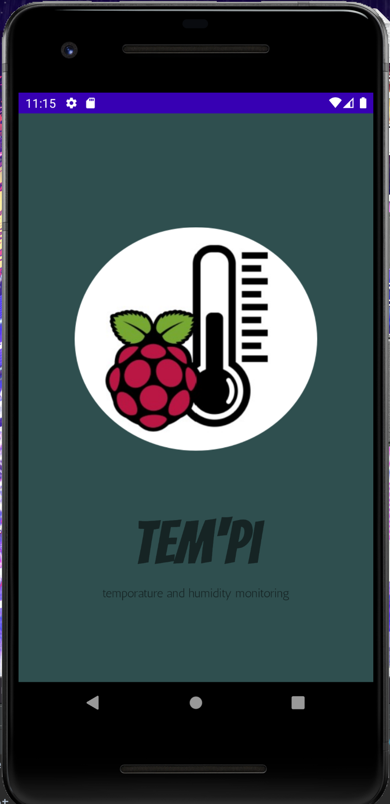
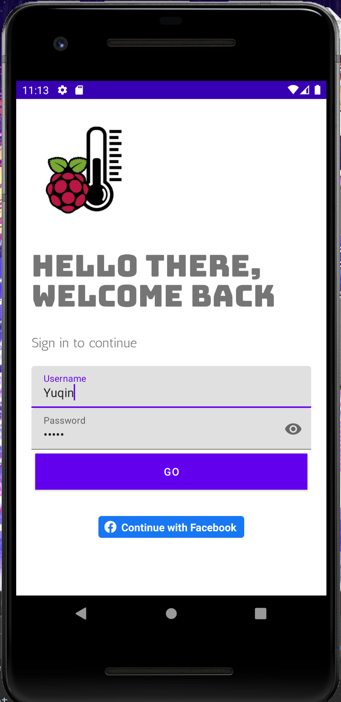
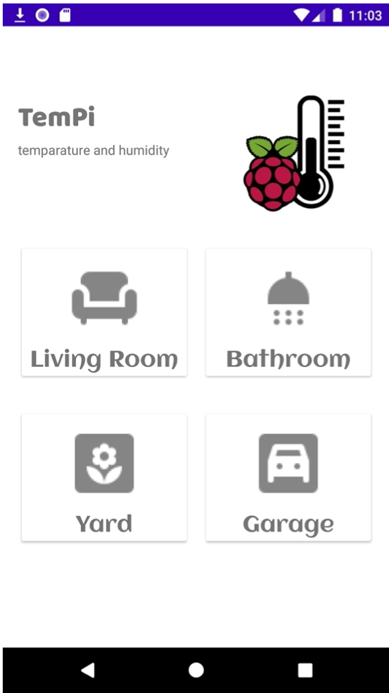
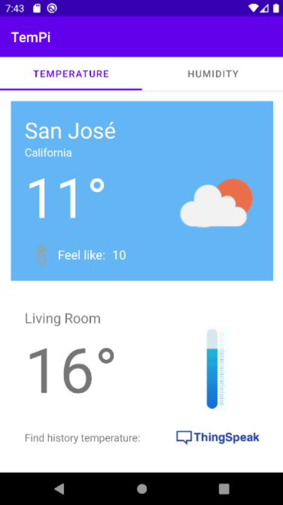

# 🌡️TemPi

## Description
The vision of my project is to create a smart home environment for app users. 

The goal for TemPi is to let the user be able to monitor home temperature and humidity at anytime from anywhere.
It  is designed to connect user’s Android phone with our IOT (Internet of things) devices. Specifically, raspberry pie, temperature/humidity sensor and the cloud. As a result, the user could check the temperature and humidity of the specific location (bedroom, living room and so on) of the user’s house in the real time through our APP. As well as the history of the temperature and humidity at that location.

## App Walk-through

 
    
    

 
    
    

## Related Skills
* Data Monitor
* User Login
* Cloud Backup
* Fetch dynamic data
